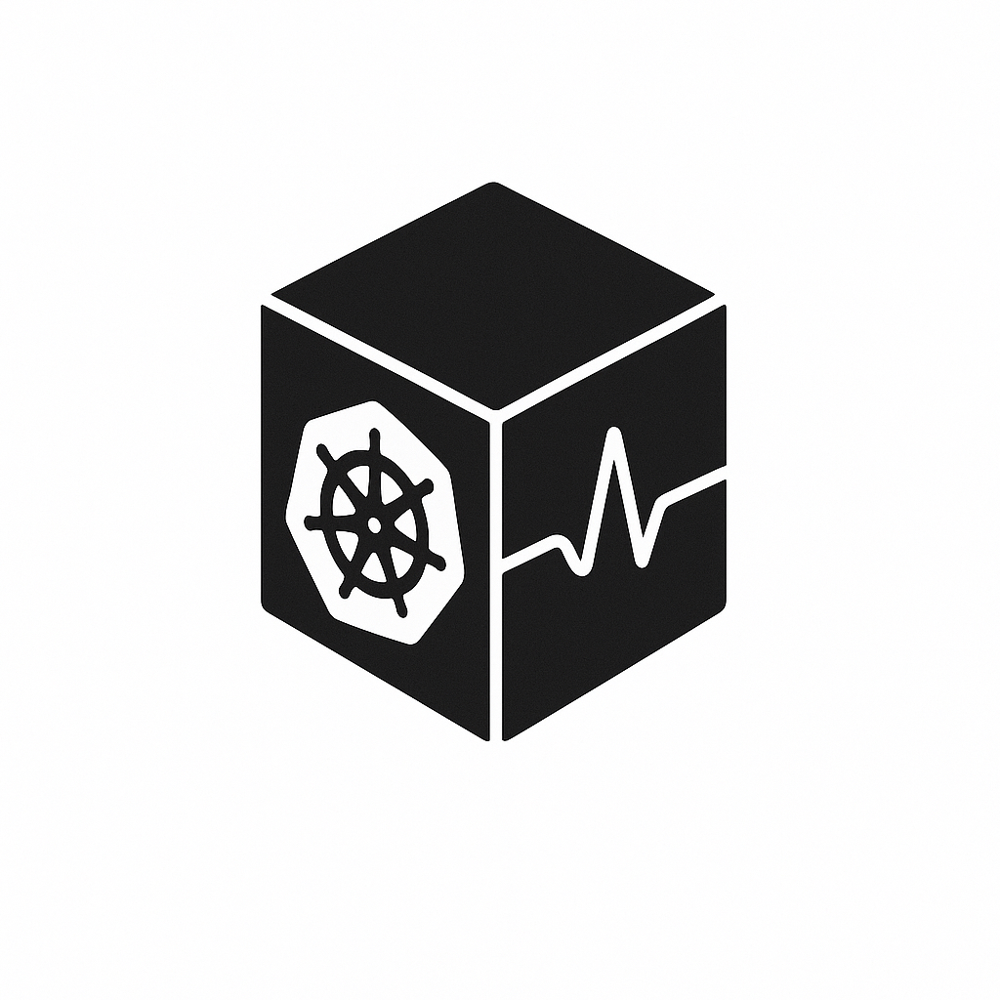

<p align="center">
  
</p>

# BlackBox :: Daemon

A Kubernetes Pod Flight Recorder - Comprehensive system and application telemetry capture for crash analysis and debugging

Created by: [William Michael Mortl](https://williammortl.com)

## Menu

* [Overview](#overview) <br />
* [Quick Start](#quick-start) <br />
* [Documentation](#documentation) <br />
* [API Reference](#api-reference) <br />

## Overview

BlackBox-Daemon runs as a daemonset on Kubernetes nodes and acts like an airplane's black box, recording everything happening on the node so that when a pod crashes or has problems, you can review all telemetry data from a configurable time window (default 60 seconds). This data can then be fed to AI systems for automated crash analysis and root cause identification.

## Features

### Core Functionality
- **Real-time System Monitoring**: Collects comprehensive Linux system metrics (CPU, memory, network, disk, processes)
- **Ring Buffer Storage**: In-memory sliding window of telemetry data for performance
- **Pod Crash Detection**: Monitors Kubernetes pods and detects crashes, OOM kills, and failures
- **Sidecar Integration**: REST API for application sidecars to submit runtime-specific telemetry
- **Configurable Output**: Multiple formatters (default, JSON, CSV) and destinations (file, stdout, HTTP)

### System Telemetry Collected
- CPU usage per core
- Memory usage (total, free, available, buffers, cached, swap)
- Network I/O per interface (bytes, packets, errors)
- Disk I/O per device (reads, writes, operations)
- Process metrics (count, open files, load averages)
- Kernel events and system calls

### API & Integration
- **REST API**: Authenticated endpoint for sidecar telemetry submission
- **Swagger Documentation**: Optional OpenAPI documentation
- **Prometheus Metrics**: Comprehensive metrics export for monitoring
- **Kubernetes Integration**: Native pod monitoring and event detection

## Quick Start

### Prerequisites
- **Kubernetes cluster** (v1.20+ recommended)
- **Go 1.25+** (for building from source, required by Kubernetes client libraries)
- **Docker** (for containerized deployment)
- **Linux system** (for /proc and /sys filesystem access)

### Docker Compose (Testing)

```bash
# Clone the repository
git clone https://github.com/verygoodsoftwarecompany/blackbox-daemon.git
cd blackbox-daemon

# Start with Docker Compose for testing
docker-compose up -d

# Check logs
docker-compose logs blackbox-daemon

# Test API
curl -X POST http://localhost:8080/api/v1/telemetry \
  -H "Authorization: Bearer test-api-key-12345" \
  -H "Content-Type: application/json" \
  -d '{
    "pod_name": "test-pod",
    "namespace": "default", 
    "runtime": "jvm",
    "data": {
      "heap_usage": 75.5,
      "gc_count": 12,
      "thread_count": 24
    }
  }'

# View metrics
curl http://localhost:9090/metrics
```

### Kubernetes Deployment

```bash
# Build and tag the image
docker build -t blackbox-daemon:latest .

# Update the API key in deployments/kubernetes.yaml
# Change "your-secure-api-key-here" to a secure random key

# Deploy to Kubernetes
kubectl apply -f deployments/kubernetes.yaml

# Check daemonset status
kubectl get daemonset -n kube-system blackbox-daemon

# View logs
kubectl logs -n kube-system -l app=blackbox-daemon -f
```

## Documentation

### Technical Documentation
For detailed technical information about BlackBox-Daemon's architecture and components, see the [Technical Documentation](docs/README.md).

#### Component Documentation
- **[Architecture Overview](docs/architecture.md)** - System design and component interaction
- **[Ring Buffer](docs/components/ringbuffer.md)** - In-memory telemetry storage system
- **[Metrics Collector](docs/components/metrics.md)** - Prometheus metrics and monitoring
- **[Formatter System](docs/components/formatter.md)** - Output formatting and destinations
- **[API Server](docs/components/api.md)** - REST API for sidecar integration
- **[System Telemetry](docs/components/telemetry.md)** - Linux system metrics collection
- **[Kubernetes Integration](docs/components/k8s.md)** - Pod monitoring and crash detection

#### Integration Guides
- **[Sidecar Integration](docs/integration/)** - Language-specific sidecar examples
- **[Deployment Guide](docs/deployment/)** - Production deployment best practices
- **[Monitoring Setup](docs/monitoring/)** - Prometheus and Grafana configuration

---

## Configuration

BlackBox-Daemon is configured via environment variables:

### Core Settings
- `BLACKBOX_BUFFER_WINDOW_SIZE`: Time window for telemetry retention (default: "60s")
- `BLACKBOX_COLLECTION_INTERVAL`: System metrics collection frequency (default: "1s")
- `BLACKBOX_API_KEY`: Authentication key for sidecar API (required)

### API Configuration
- `BLACKBOX_API_PORT`: API server port (default: 8080)
- `BLACKBOX_SWAGGER_ENABLE`: Enable Swagger documentation (default: false)

### Metrics Configuration  
- `BLACKBOX_METRICS_PORT`: Prometheus metrics port (default: 9090)
- `BLACKBOX_METRICS_PATH`: Metrics endpoint path (default: "/metrics")

### Output Configuration
- `BLACKBOX_OUTPUT_FORMATTERS`: Comma-separated list of formatters (default: "default")
  - Available: `default`, `json`, `csv`
- `BLACKBOX_OUTPUT_PATH`: Output directory or destination (default: "/var/log/blackbox")

### Kubernetes Settings
- `NODE_NAME`: Kubernetes node name (automatically set in daemonset)
- `POD_NAMESPACE`: Current namespace (automatically set)
- `KUBECONFIG`: Path to kubeconfig file (optional, uses in-cluster config by default)

### Logging
- `BLACKBOX_LOG_LEVEL`: Log level (default: "info", options: debug, info, warn, error)
- `BLACKBOX_LOG_JSON`: JSON log format (default: true)

## API Reference

### Telemetry Submission
```http
POST /api/v1/telemetry
Authorization: Bearer <api-key>
Content-Type: application/json

{
  "pod_name": "my-app-pod",
  "namespace": "production",
  "container_id": "docker://abc123...",
  "runtime": "jvm",
  "timestamp": "2024-11-02T15:04:05Z",
  "data": {
    "heap_used": 1073741824,
    "heap_max": 2147483648,
    "gc_collections": 15,
    "threads_active": 32,
    "custom_metric": 42.5
  }
}
```

### Incident Reporting
```http
POST /api/v1/incident
Authorization: Bearer <api-key>
Content-Type: application/json

{
  "pod_name": "my-app-pod",
  "namespace": "production",
  "severity": "critical",
  "type": "crash",
  "message": "Application crashed with OutOfMemoryError"
}
```

### Health Check
```http
GET /api/v1/health

Response:
{
  "status": "healthy",
  "timestamp": "2024-11-02T15:04:05Z",
  "service": "blackbox-daemon",
  "version": "1.0.0"
}
```

## Sidecar Integration

BlackBox-Daemon is designed to work with sidecars that collect runtime-specific telemetry:

### JVM Sidecar Example
```java
// Submit JVM telemetry
Map<String, Object> telemetry = Map.of(
    "heap_used", Runtime.getRuntime().totalMemory() - Runtime.getRuntime().freeMemory(),
    "heap_max", Runtime.getRuntime().maxMemory(),
    "gc_collections", getGCCollections(),
    "threads_active", Thread.activeCount()
);

submitTelemetry("my-java-app", "production", "jvm", telemetry);
```

### .NET Sidecar Example
```csharp
// Submit .NET telemetry
var telemetry = new Dictionary<string, object>
{
    ["heap_size"] = GC.GetTotalMemory(false),
    ["gen0_collections"] = GC.CollectionCount(0),
    ["gen1_collections"] = GC.CollectionCount(1),
    ["gen2_collections"] = GC.CollectionCount(2),
    ["thread_count"] = Process.GetCurrentProcess().Threads.Count
};

await SubmitTelemetryAsync("my-dotnet-app", "production", "dotnet", telemetry);
```

## Output Formats

### Default Format
```
=== INCIDENT REPORT ===
ID: crash-my-app-1699123456
TIMESTAMP: 2024-11-02 15:04:05.123
SEVERITY: critical
TYPE: crash
MESSAGE: Pod my-app crashed with exit code 1
POD: production/my-app

=== TELEMETRY DATA ===
2024-11-02 : 15:04:04.000 | cpu0_usage_percent | 45.2
2024-11-02 : 15:04:04.000 | memory_usage_percent | 78.5
2024-11-02 : 15:04:04.000 | heap_used | 1073741824
...
```

### JSON Format
```json
{
  "incident": {
    "id": "crash-my-app-1699123456",
    "timestamp": "2024-11-02T15:04:05.123Z",
    "severity": "critical",
    "type": "crash",
    "message": "Pod my-app crashed with exit code 1"
  },
  "telemetry": [...],
  "generated_at": "2024-11-02T15:04:10.000Z"
}
```

## Monitoring & Metrics

BlackBox-Daemon exports comprehensive Prometheus metrics:

### System Metrics
- `blackbox_cpu_usage_percent{core}`: CPU usage per core
- `blackbox_memory_bytes{type}`: Memory usage by type
- `blackbox_network_bytes_total{interface,direction}`: Network I/O
- `blackbox_disk_io_bytes_total{device,direction}`: Disk I/O
- `blackbox_load_average{period}`: System load averages

### Operational Metrics
- `blackbox_sidecar_requests_total`: Total sidecar API requests
- `blackbox_incidents_total{type,severity}`: Incident counts
- `blackbox_buffer_entries_total`: Ring buffer entry count
- `blackbox_buffer_size_bytes`: Ring buffer memory usage

## Development

## Building from Source

### Requirements
- **Go 1.25+** (required for Kubernetes client libraries)
- **Linux environment** (for system telemetry collection)
- **Git** (to clone repository)

### Build Steps
```bash
# Clone the repository
git clone https://github.com/verygoodsoftwarecompany/blackbox-daemon.git
cd blackbox-daemon

# Verify Go version (must be 1.25+)
go version

# Download dependencies and verify checksums
go mod download
go mod verify
go mod tidy

# Build the binary with optimizations
go build -ldflags="-w -s" -o blackbox-daemon ./cmd/blackbox-daemon

# Verify the build
./blackbox-daemon --version

# Run locally with required environment variables
export BLACKBOX_API_KEY="your-secure-api-key-here"
export NODE_NAME=$(hostname)
sudo ./blackbox-daemon
```

### Docker Build
```bash
# Build Docker image
docker build -t blackbox-daemon:latest .

# Verify image
docker images | grep blackbox-daemon

# Test run (development only)
docker run --rm -p 8080:8080 -p 9090:9090 \
  -e BLACKBOX_API_KEY="test-api-key-12345" \
  -e NODE_NAME="test-node" \
  blackbox-daemon:latest
```

### Cross-Compilation
```bash
# Build for different architectures
GOOS=linux GOARCH=amd64 go build -o blackbox-daemon-linux-amd64 ./cmd/blackbox-daemon
GOOS=linux GOARCH=arm64 go build -o blackbox-daemon-linux-arm64 ./cmd/blackbox-daemon

# Build for multiple platforms
make build-all  # If Makefile exists
```

### Build Verification
```bash
# Use Make targets for comprehensive testing
make test          # Run all tests with coverage report
make race          # Run tests with race condition detection
make benchmark     # Run performance benchmarks
make lint          # Run code linting (requires golangci-lint)
make sec-scan      # Security vulnerability scan (requires gosec)

# Manual testing (if preferred)
go test ./...      # Run all tests
go test -race ./...  # Race detection
go test -cover ./... # Coverage analysis
```

### Running Tests

The project uses a comprehensive Makefile for testing. See [BUILD.md](docs/BUILD.md) for detailed build and test instructions.

#### Quick Testing
```bash
# Run comprehensive test suite with coverage
make test

# Quick build pipeline (clean, test, build)
make q

# Test with race condition detection
make race

# Performance benchmarks
make benchmark
```

#### Manual Test Commands
```bash
# Run all tests
go test -v ./...

# Run specific package tests
go test -v ./pkg/types/
go test -v ./internal/ringbuffer/
go test -v ./internal/api/

# Generate coverage report
go test -coverprofile=coverage.out ./...
go tool cover -html=coverage.out -o coverage.html
```

#### Advanced Testing
```bash
# Full CI pipeline
make ci

# Security scanning
make sec-scan

# Cross-platform builds with testing
make build-all
```

### Adding Custom Formatters
```go
// Implement the Formatter interface
type MyCustomFormatter struct{}

func (f *MyCustomFormatter) Name() string {
    return "custom"
}

func (f *MyCustomFormatter) Format(entries []types.TelemetryEntry, incident types.IncidentReport) ([]byte, error) {
    // Custom formatting logic
    return data, nil
}

// Register with formatter chain
chain.AddFormatter(NewMyCustomFormatter(), destinations...)
```

## Architecture

```
┌─────────────────────────────────────────────────────────┐
│                    BlackBox Daemon                      │
├─────────────────────────────────────────────────────────┤
│  System Telemetry    │  Kubernetes     │  REST API      │
│  Collector           │  Pod Watcher    │  Server        │
│  ┌─────────────────┐ │ ┌─────────────┐ │ ┌─────────────┐│
│  │ CPU, Memory,    │ │ │ Pod Events, │ │ │ Sidecar     ││
│  │ Network, Disk,  │ │ │ Crashes,    │ │ │ Telemetry,  ││
│  │ Processes       │ │ │ OOM Kills   │ │ │ Incidents   ││
│  └─────────────────┘ │ └─────────────┘ │ └─────────────┘│
├─────────────────────────────────────────────────────────┤
│                   Ring Buffer (In-Memory)               │
│              60s Sliding Window of Telemetry            │
├─────────────────────────────────────────────────────────┤
│  Incident Handler   │ Formatter Chain │ Metrics Export  │
│ ┌─────────────────┐ │┌─────────────────┐│┌─────────────┐│
│ │ Crash Detection │ ││ Default, JSON,  ││ │ Prometheus │ │
│ │ Report Gen      │ ││ CSV Formatters  ││ │ /metrics   │ │
│ └─────────────────┘ │└─────────────────┘│└─────────────┘│
└─────────────────────────────────────────────────────────┘
```

## Security Considerations

- **API Authentication**: All sidecar endpoints require Bearer token authentication
- **RBAC**: Minimal Kubernetes permissions (read-only pods and events)
- **Non-root**: Runs as non-root user in containers
- **Read-only Filesystem**: Container uses read-only root filesystem
- **Resource Limits**: CPU and memory limits to prevent node impact

## Troubleshooting

### Common Issues

1. **Permission Denied reading /proc or /sys**
   - Ensure container has `hostPID: true` and proper volume mounts
   - Check that host paths `/proc` and `/sys` are accessible

2. **API Returns 401 Unauthorized**
   - Verify `BLACKBOX_API_KEY` is set correctly
   - Check Authorization header format: `Bearer <key>`

3. **No Metrics Appearing**
   - Confirm system telemetry collection is working via logs
   - Check Prometheus scrape configuration and network connectivity

4. **High Memory Usage**
   - Reduce `BLACKBOX_BUFFER_WINDOW_SIZE` for less retention
   - Monitor `blackbox_buffer_size_bytes` metric

5. **Pods Not Detected**
   - Verify RBAC permissions for pod access
   - Check `NODE_NAME` environment variable is set correctly

### Debug Mode
```bash
# Enable debug logging
export BLACKBOX_LOG_LEVEL=debug

# Check health endpoint
curl http://localhost:8080/api/v1/health

# View raw metrics
curl http://localhost:9090/metrics | grep blackbox_
```

## License

Licensed under the MIT License. See [LICENSE](LICENSE) file for details.

## Contributing

The [contribution guide](CONTRIBUTING.md) covers everything you need to know about how you can contribute to Azure Service Operators.

## Support and feedback

For help, please use the following resources:

1. Review the [documentation](#documentation)
2. Search [open issues](https://github.com/Azure/azure-service-operator/issues). If your issue is not represented there already, please [open a new one](https://github.com/Azure/azure-service-operator/issues/new/choose).
3. Chat with us on the `azure-service-operator` channel of the [Kubernetes Slack](https://kubernetes.slack.com/). If you are not a member you can get an invitation from the [community inviter](https://communityinviter.com/apps/kubernetes/community).

## Code of conduct

This project has adopted the [Microsoft Open Source Code of Conduct](https://opensource.microsoft.com/codeofconduct/). For more information, see the [Code of Conduct FAQ](https://opensource.microsoft.com/codeofconduct/faq) or contact [opencode@microsoft.com](mailto:opencode@microsoft.com) with any additional questions or comments.